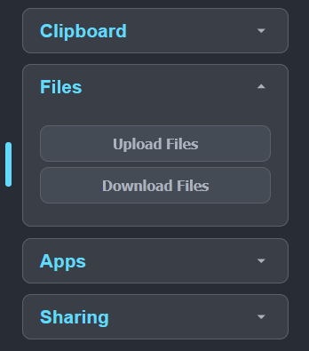
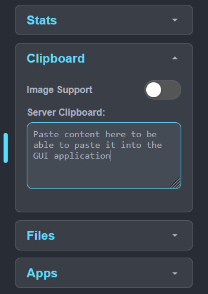
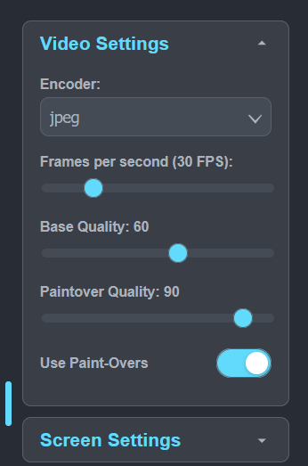

# Media Server Setup

Set up home media server automatically with [Ansible](https://docs.ansible.com/ansible/latest/getting_started/introduction.html).

The playbooks in this media server can be used to set up:

- [copyparty](https://github.com/9001/copyparty) for sharing and uploading files.
- [Jellyfin](https://jellyfin.org/) for viewing media.
- [Calibre](https://calibre-ebook.com/) and [calibre-web](https://github.com/janeczku/calibre-web) for uploading and reading books.
- A set of \*arr apps I use, including Radarr, Sonarr, Prowlarr, SABnzbd, and Jellyseerr.
- [Caddy](https://caddyserver.com/) for reverse proxying services so they're available on the web.

*All* deployed services using these playbooks are run in containers using Podman.

## Ansible Setup

These steps will enable you to run the playbooks from your control node on the media server remote.

### Control Node Setup

To install Ansible on your control node (i.e., the host where you are running the playbooks from), use [uv](https://docs.astral.sh/uv/getting-started/installation/).

After installing `uv`, pull this repository and run:

```shell
uv venv
source .venv/bin/activate
uv sync
```

If you're using VSCode, you'll need to set the Python interpeter Path.

- Press **CTRL + Shift + P**
- Enter **Python: Select Interpreter**
- Select **.venv/bin/python**
- Restart your terminal if you have one open. You should see `(ansible-media-server)` at the start of your prompt if the virtual environment is activated correctly.

Prior to running any playbooks, double check that the required Ansible collections are installed:

```shell
ansible-galaxy collection install -r requirements.yml
```

### Remote Host Setup

Prior to running the playbooks here, ensure there is a user account called `ansible` on the target (i.e., the remote home server), and that it has the ability to run sudo without a password. Run these commands on the remote server (sudo access needed):

```shell
# Create user with a home directory
sudo useradd --create-home ansible
sudo groupadd ansible
sudo usermod -aG ansible ansible

# Set the user's password
sudo passwd ansible

# Give the user access to run sudo
sudo echo "ansible ALL = (root) NOPASSWD:ALL" > /etc/sudoers.d/ansible
```

Additionally, ensure you add the public key of your control node to the ansible user's `authorized_keys` file.

First, make a public key if you don't have one on your control node.

```shell
ssh-keygen -t ed25519
```

Then run the following command from your control node to add your public key to the ansible user's authorized keys. Substitute `home-server` with your home server's actual host name.

```shell
ssh ansible@home-server sh -c "cat - >> ~/.ssh/authorized_keys" < ~/.ssh/id_ed25119.pub
```

### Inventory

You should add your home server's IP address or host name to the `homeserver` host in the `inventory/hosts.yml` file.

To encrypt your own `ansible_host`, you can use:

```shell
ansible-vault encrypt_string 'remote-server' --name 'ansible_host'
```

Substituting `remote-server` with your remote host's actual IP or host name. You can then paste that into the `hosts.yml` file.

You can test running commands on the remote host with:

```shell
ansible all -m command -a "uptime" -i inventory
```

## Secrets

It's recommended to store API tokens and other secret variables in an Ansible vault. If you create an Ansible vault at `group_vars/all/vault.yml`, Ansible will pick them up automatically. You can store the password to the vault anywhere outside of this repository, but I store it in a file called `~/.ansible_vault_password`.

You can edit the variables in the encrypted file with:

```shell
export ANSIBLE_VAULT_PASSWORD_FILE=~/.ansible_vault_password
export EDITOR=vim
ansible-vault edit group_vars/all/vault.yml
```

### Required Secrets

All encrypted variables are given a `v_` prefix. Deploying some services require certain secrets to be set, see the description for each service.

## Editor Setup

If you're using VSCode, install recommended extensions by searching for `@recommended` in the extensions search box and install all the extensions listed there.

## Playbook: setup-common.yml

**This playbook should be run first to prep the server for later playbooks.**

The main purpose of this playbook is to create a non-root user for running containers. It also runs other one-time setup tasks that other playbooks will depend on having been executed.

The `podman` user is used extensively to provide a non-root user for storing configuration files and for running containers as a non-root user.

**This playbook should be run first on a new server.** This is because the other playbooks depend on this user existing.

To create the `podman` user with user ID and group ID 1010, run:

```shell
ansible-playbook -i inventory setup-podman-user.yml
```

### Secret Variables

This variable needs to be set before running this playbook:

| Name                   | Description                                    | Requirement     |
| ---------------------- | ---------------------------------------------- | --------------- |
| v_podman_user_password | The hashed value of the podman user's password | Always required |

## Playbook: setup-copyparty.yml

[Copyparty](https://github.com/9001/copyparty) is a file sharing server that supports a wide range of browsers and protocols.

Copyparty can be installed with the `setup-copyparty.yml` playbook. You can optionally turn on reverse proxying for copyparty using the `copyparty_reverse_proxy` variable. This creates a shared network with the `caddy` container so that Caddy can access copyparty.

To set up copyparty, run:

```shell
ansible-playbook -i inventory setup-copyparty.yml
```

### Volumes

You can share parts of your server's file with copyparty by using the `copyparty_volumes` variables. This can be controlled by editing `copyparty.volumes` in the `host_vars/homeserver.yml` file.

`volumes` is a list of objects with three attributes:

- `web_path`: The path on the server that the files will be accessible at. Use `/` to see your files when you first log in to copyparty.
- `container_path`: The path in the copyparty container that you want to mount your server's files at.
- `host_path`: The local path on your server that contains the files you want to share

This example creates two shares:

1. The podman user's home directory, at `/`
2. The `/data/media/` directory, at `/media/`

```yaml
copyparty:
  volumes:
    - web_path: /
      container_path: /podman/
      host_path: /home/podman/

    - web_path: /media/
      container_path: /media/
      host_path: /data/media/
```

### Sharing

You can enable file sharing with the `copyparty_enable_sharing` variable. If this is set to `true`, you can define a path with `copyparty_share_web_path` where [shares](https://github.com/9001/copyparty?tab=readme-ov-file#shares) will be accessible from. The files you share don't get copied or moved, so there's no need to specify where on your host the files are shared from.

### Secret Variables

The following table outlines the secret variables that may need to be set for this playbook to work.

| Name                       | Description                                      | Requirement     |
| -------------------------- | ------------------------------------------------ | --------------- |
| v_copyparty_admin_username | The admin username                               | Always required |
| v_copyparty_admin_password | A plaintext password used to log in as the admin | Always required |

## Playbook: setup-calibre.yml

[Calibre](https://github.com/kovidgoyal/calibre/) is an open-source e-book manager. Calibre is a desktop GUI application, but can be accessed over the web using this setup. [Calibre Web](https://github.com/janeczku/calibre-web) is a web optimized interface that enables you to access an existing Calibre library.

Images used:

- [lscr.io/linuxserver/calibre](https://docs.linuxserver.io/images/docker-calibre/)
- [lscr.io/linuxserver/calibre-web](https://docs.linuxserver.io/images/docker-calibre-web/)

Calibre and Calibre Web can be installed with the `setup-calibre.yml` playbook. You can optionally turn on reverse proxying for Calibre Web using the `calibre_web_reverse_proxy` variable. This creates a shared network with the caddy container so that Caddy can access Calibre Web. Note that, when reverse proxying Calibre, only the Calibre Web interface is exposed. The desktop GUI interface can only be accessed locally.

To set up Calibre, run:

```shell
ansible-playbook -i inventory setup-calibre.yml
```

After installing, ensure you follow these steps to set up your library:

- [Calibre application setup](https://docs.linuxserver.io/images/docker-calibre/#application-setup). You don't necessarily need to enable Calibre's web server since we have calibre-web for that.
- [Calibre Web application setup](https://docs.linuxserver.io/images/docker-calibre-web/#application-setup)

**NOTE:** If you're reverse proxying Calibre Web, you might notice an issue with having to log in over and over again. To fix that, follow the steps in [this comment](https://github.com/janeczku/calibre-web/issues/2422#issuecomment-1817122953). You need to set the security configuration to "Basic" by going to **Admin** > **Edit Basic Configuration** > **Security Settings** > **Session Protection** to fix this issue.

There are sane defaults set for Calibre so you shouldn't need to tweak them ([see defaults here](roles/calibre-podman/defaults/main.yml)). One variable you *might* want to tweak is the location of the upload directory. This directory is where you can upload books so that they appear in the Calibre GUI file explorer, *not* where books are stored. That is controlled with the `calibre_upload_dir` variable.

### Using the GUI

Since Calibre is a GUI application, there are quirks with accessing it via a web interface. Here are some tips to use it:

- There are two way to upload files so that you can add new books. The first way is to copy them to your server at `/data/media/upload/books/` (or wherever you set `calibre_upload_dir`). These uploads can be accessed at the `/books/` directory when you click **Add books** in Calibre.
  - Tip: You might use Copyparty to upload files to this location.
- Alternately, use the Selkies Dashboard to upload files via a web uploader. To open the dashboard, click the light blue button on the left side of the screen and find the **Files** section. Files uploaded in this way get uploaded to `/config/Desktop`. This path can be configured using the `FILE_MANAGER_PATH` environment variable.



- To paste from your clipboard into the web interface, you must use the **Clipboard** section in the Selkies Dashboard. The content you want to paste should be placed in the **Server Clipboard** text input.



- If you experience performance issues (i.e., low frame rate) in your browser, you can try one of two things. You can choose a hardware render node that support VAAPI with the `calibre_vaapi_render_node`, or you can set the **Encoder** to **jpeg** in the Selkies **Video settings**. I've not been able to get the hardware encoding working, but the **jpeg** renderer is a lot quicker on my hardware (with worse image quality).



### Secret Variables

The following table outlines the secret variables that may need to be set for this playbook to work.

| Name                       | Description                                       | Requirement           |
| -------------------------- | ------------------------------------------------- | --------------------- |
| v_calibre_password         | The password to access the desktoip GUI           | Always required       |

You might notice there is no setup for the calibre-web username and password. Those can only be configured through the application itself.

## Playbook: setup-jellyfin.yml

[Jellyfin](https://github.com/jellyfin/jellyfin) is an open source media server.

Jellyfin can be installed with the `setup-jellyfin.yml` playbook. You can optionally turn on reverse proxying for Jellyfin using the `jellyfin_reverse_proxy` variable. This creates a shared network with the caddy container so that Caddy can access Jellyfin.

To set up Jellyfin, run:

```shell
ansible-playbook -i inventory setup-jellyfin.yml
```

There are sane defaults set for Jellyfin so you shouldn't need to tweak them ([see defaults here](roles/jellyfin-podman/defaults/main.yml)). One variable you *might* want to tweak is the location of the media library on your localhost. That is controlled with the `jellyfin_media_dir` variable. But be aware that this directory must be within the the `starrapps_media_dir` if you are running the starrapps (see playbook below).

### Secret Variables

The following table outlines the secret variables that may need to be set for this playbook to work.

| Name                       | Description                                       | Requirement           |
| -------------------------- | ------------------------------------------------- | --------------------- |
| v_jellyfin_domain          | The domain where your Jellyfin instance is served | When reverse proxying |

## Playbook: setup-caddy.yml

Caddy is used to reverse proxy the services on the media server so that they can be served over HTTPS on the web.

Caddy can be set up with the `setup-caddy.yml` playbook. The `caddy` role assumes you are using Cloudflare for your domains, so requires at minimum a Cloudflare API token to authenticate with.

**You should run this playbook *after* setting up the services that will be reverse proxied**. Otherwise, Caddy will complain about not being able to get certificates for your domains.

```shell
ansible-playbook -i inventory setup-caddy.yml
```

The services that caddy reverse proxies should be defined in `host_vars/homeserver.yml`. The `reverse_proxy_hosts` should be a list of objects containing three attributes (see below). For example, this will set Caddy to reverse proxy two services:

```yaml
caddy:
  reverse_proxy_hosts:
    - domain_name: the-public.domain.com
      container_name: the_container_name
      port: the_exposed_port
    - domain_name: example.com
      container_name: the_other_container_name
      port: the_other_exposed_port
```

Any container or pod that uses the `web-services.network` can be reverse proxied by Caddy. If you want to reverse proxy a service in a Pod, you should reference the name of the pod with the `container_name`, not the name of the service inside the pod.

If your host does not have a static IP (e.g., if your ISP does not allow it), there is an included script that is deployed that will update the IPv4 address of your domains to the host's IP address whenever it changes. To enable this feature, set:

```yaml
caddy:
  host_ip_is_static: false
```

And the script will be deployed automatically. All of the DNS records within the set `caddy_cloudflare_zone_id` (i.e., the given Zone in Cloudflare) will have the IP address of their DNS A records set to the remote host's IP address.

Note that you will need to enable port forwarding for ports 80/tcp, 443/tcp, and 443/udp on your router as well if you want your services publicly accessible.

### Secret Variables

The following table outlines the secret variables that may need to be set for this playbook to work.

| Name                         | Description                                                  | Requirement                |
| ---------------------------- | ------------------------------------------------------------ | -------------------------- |
| v_caddy_cloudflare_api_token | The cloudflare API token used for authentication             | Always required            |
| v_caddy_cloudflare_zone_id   | The zone ID of the DNS records pointing to the remote server | When host IP is not static |
